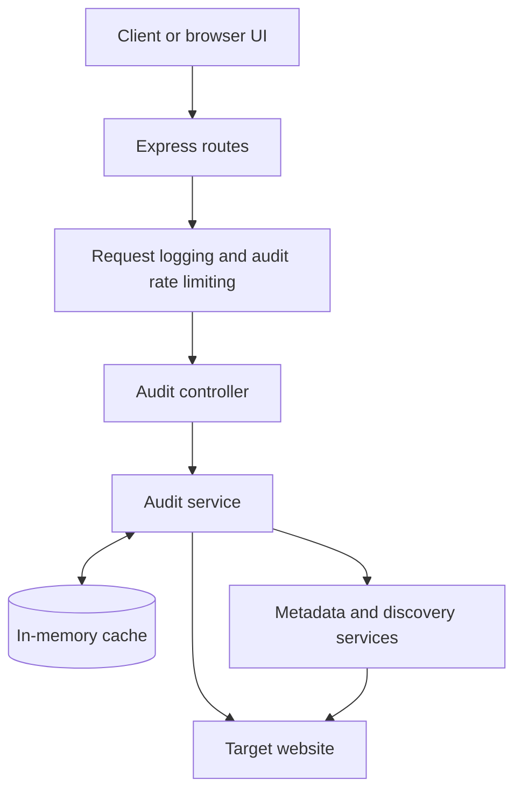

# PagePulse

> **Production Website Audit Service**

PagePulse is a production-oriented website audit service with a polished browser interface and a structured JSON API. It gives developers a fast, reliable view of a public page’s HTTP behavior, metadata, transport security, and discovery files while handling caching, request protection, and operational visibility behind the scenes.

## Highlights

- Website metadata auditing
- Redirect and final-URL tracking
- HTTPS detection
- `robots.txt` and sitemap discovery
- Intelligent in-memory caching
- Per-IP rate limiting
- Structured JSON logging with request IDs
- Comprehensive automated testing
- Continuous integration with GitHub Actions

---

## Features

### Website intelligence

- Validates absolute HTTP and HTTPS URLs before starting an audit.
- Follows redirects and reports both the final URL and upstream HTTP status.
- Measures the time required to fetch and consume the page response.
- Extracts the page title, meta description, and canonical URL with Cheerio.
- Detects whether the submitted URL uses HTTPS.
- Probes `/robots.txt` and `/sitemap.xml` with lightweight `HEAD` requests.
- Falls back to ranged `GET` requests when an origin does not support `HEAD`.

### Reliability and request protection

- Caches successful audits by normalized URL with a configurable TTL.
- Coalesces concurrent audits for the same normalized URL to avoid duplicate outbound work.
- Applies a configurable fixed-window rate limit per client IP.
- Automatically removes expired cache entries and rate-limit windows.
- Keeps validation errors and failed fetches out of the cache.
- Supports graceful `SIGTERM` and `SIGINT` shutdown.

### Operations and quality

- Emits structured Pino logs with request IDs and sensitive-field redaction.
- Returns consistent, structured error responses.
- Includes unit and integration tests that never depend on the public internet.
- Runs lint, test, and build checks on every push and pull request.
- Serves a responsive, dependency-free frontend built with HTML, CSS, and JavaScript.

---

## Architecture Overview

PagePulse follows a route → middleware → controller → service architecture. Express owns HTTP concerns, middleware handles request-scoped protections, the controller validates and maps the API contract, and focused services perform auditing, caching, metadata extraction, discovery-file checks, rate limiting, and logging.



| Layer      | Responsibility                                                                                                        |
| ---------- | --------------------------------------------------------------------------------------------------------------------- |
| Routes     | Define the public health and audit endpoints.                                                                         |
| Middleware | Attach request IDs, emit request logs, parse JSON, and protect `POST /audit` with per-IP rate limiting.               |
| Controller | Validate input, coordinate audit logs, and map service outcomes to the documented API contract.                       |
| Services   | Own page fetching, metadata extraction, resource probing, caching, rate-limit state, and structured logging.          |
| Frontend   | Call the same audit API and present healthy, restricted, cached, and error states without changing backend semantics. |

For the complete request flow, see [docs/architecture.md](docs/architecture.md). Architecture decisions, trade-offs, failure handling, scalability, and security considerations are documented in [docs/task-b.md](docs/task-b.md).

### Caching strategy

Only successful audits are cached. The cache key is the normalized URL: parsing normalizes the scheme and host, removes default ports and fragments, and preserves the path and query string. The default TTL is five minutes.

The first request performs the audit. Concurrent requests for the same key await that work and report `cacheHit: true`; later requests read the stored result and report its age. Validation errors and fetch failures are never cached. Entries are process-local, removed after expiration, and lost during restarts or deployments.

### Rate limiting

`POST /audit` uses an in-memory fixed window keyed by Express’s resolved client IP. By default, each IP can make 30 requests every 60 seconds. Rejected requests receive the remaining window duration, and expired windows are cleaned automatically.

> [!NOTE]
> Cache entries and rate-limit counters are process-local. Multiple service instances do not share state; a distributed store is a future scaling requirement.

### Logging and lifecycle

Pino emits one-line JSON logs to standard output. Every request log includes:

- Request ID
- HTTP method and route
- Client IP
- Response status and response time
- Whether the connection was aborted

Audit logs additionally include the normalized URL, cache status, audit duration, and success state. Error logs serialize stack traces. Full HTML, authorization headers, cookies, request bodies, and known sensitive fields are redacted or never logged. Startup and shutdown lifecycle events are structured as well.

---

## Tech Stack

| Category               | Technology                               |
| ---------------------- | ---------------------------------------- |
| Runtime                | Node.js 22 LTS                           |
| Backend                | Express 5                                |
| Language               | TypeScript with strict compiler settings |
| HTTP client            | Native Node.js `fetch`                   |
| HTML parsing           | Cheerio                                  |
| Logging                | Pino                                     |
| Frontend               | HTML, CSS, and vanilla JavaScript        |
| Testing                | Vitest and Supertest                     |
| Code quality           | ESLint and Prettier                      |
| Continuous integration | GitHub Actions                           |

---

## Project Structure

```text
.
├── .github/
│   └── workflows/
│       └── ci.yml
├── docs/
│   ├── architecture.md
│   └── task-b.md
├── public/
│   ├── index.html
│   ├── script.js
│   └── styles.css
├── src/
│   ├── config/
│   ├── controllers/
│   ├── middleware/
│   ├── routes/
│   ├── services/
│   ├── utils/
│   ├── app.ts
│   └── server.ts
├── tests/
│   ├── integration/
│   └── unit/
├── .env.example
├── .nvmrc
├── eslint.config.js
├── package.json
├── tsconfig.json
└── vitest.config.ts
```

---

## Getting Started

### Prerequisites

- Node.js compatible with the `engines.node` range in `package.json`
- npm

The included `.nvmrc` selects Node.js 22.

### 1. Install

From a local clone of the repository:

```bash
cd PagePulse
npm install
cp .env.example .env
```

No external database or cache service is required.

### 2. Configure the environment

All environment variables are optional. Invalid configured values fail fast during application startup.

| Variable                    |       Default | Validation and purpose                                            |
| --------------------------- | ------------: | ----------------------------------------------------------------- |
| `PORT`                      |        `3000` | Integer from 1 through 65535. Render supplies this automatically. |
| `HOST`                      |     `0.0.0.0` | Valid IP address or DNS hostname used for server binding.         |
| `NODE_ENV`                  | `development` | One of `development`, `test`, or `production`.                    |
| `CACHE_TTL_SECONDS`         |         `300` | Positive integer controlling successful-audit cache lifetime.     |
| `RATE_LIMIT_MAX_REQUESTS`   |          `30` | Positive integer allowed per client window.                       |
| `RATE_LIMIT_WINDOW_SECONDS` |          `60` | Positive integer fixed-window duration.                           |

Use [.env.example](.env.example) as the local template. Do not commit a real `.env` file.

### 3. Run locally

Development mode reloads when imported source files change:

```bash
npm run dev
```

Open `http://localhost:3000` for the browser interface, or check API readiness:

```bash
curl http://localhost:3000/health
```

Expected response:

```json
{
  "status": "ok"
}
```

### 4. Build and run in production

Compile the TypeScript source:

```bash
npm run build
```

Start the compiled application:

```bash
NODE_ENV=production npm start
```

The server reads `PORT` and `HOST` from the environment. It defaults to `0.0.0.0:3000` and has no runtime dependency on `localhost`.

On `SIGTERM` or `SIGINT`, PagePulse stops accepting new connections, allows active requests to finish, and enforces a 10-second upper bound before closing remaining connections.

---

## API Overview

| Method | Endpoint  | Description                                       |
| ------ | --------- | ------------------------------------------------- |
| `GET`  | `/health` | Report whether the process is accepting requests. |
| `POST` | `/audit`  | Audit an absolute HTTP or HTTPS URL.              |

### `GET /health`

Returns `200 OK`:

```json
{
  "status": "ok"
}
```

### `POST /audit`

The `url` value must be a non-empty string containing an absolute URL with the `http:` or `https:` protocol. Leading and trailing whitespace is removed before processing.

#### Request

```bash
curl --request POST http://localhost:3000/audit \
  --header 'Content-Type: application/json' \
  --data '{"url":"https://example.com"}'
```

```json
{
  "url": "https://example.com"
}
```

#### Successful response

Returns `200 OK` when the HTTP exchange with the target completes:

```json
{
  "success": true,
  "data": {
    "url": "https://example.com",
    "finalUrl": "https://example.com/",
    "status": 200,
    "responseTime": 123,
    "title": "Example Domain",
    "isHttps": true,
    "metaDescription": null,
    "canonicalUrl": null,
    "robotsTxtExists": false,
    "sitemapExists": false
  },
  "cacheHit": false,
  "cacheAgeSeconds": 0
}
```

| Field                  | Meaning                                                                                          |
| ---------------------- | ------------------------------------------------------------------------------------------------ |
| `data.url`             | Validated URL supplied by the caller after whitespace trimming.                                  |
| `data.finalUrl`        | URL after following redirects.                                                                   |
| `data.status`          | HTTP status returned by the audited origin, not the PagePulse response status.                   |
| `data.responseTime`    | Time in milliseconds to fetch and consume the page response.                                     |
| `data.title`           | Normalized HTML title, or `null` when absent.                                                    |
| `data.isHttps`         | Whether the original URL uses HTTPS.                                                             |
| `data.metaDescription` | Normalized meta description, or `null` when absent.                                              |
| `data.canonicalUrl`    | Absolute HTTP(S) canonical URL, or `null` when absent or invalid.                                |
| `data.robotsTxtExists` | Whether the final origin exposes `/robots.txt`.                                                  |
| `data.sitemapExists`   | Whether the final origin exposes `/sitemap.xml`.                                                 |
| `cacheHit`             | `true` when no new audit fetch was required for this request.                                    |
| `cacheAgeSeconds`      | Whole seconds since the cached result was created; `0` for a new or just-completed shared audit. |

> [!IMPORTANT]
> An upstream non-2xx response is still a successful audit when the HTTP exchange completes. The target’s status is returned in `data.status`; PagePulse does not misclassify a website’s access restriction as an application failure.

#### Error responses

| HTTP status | Error code            | Meaning                                                                              |
| ----------: | --------------------- | ------------------------------------------------------------------------------------ |
|       `400` | `INVALID_URL`         | The supplied value is not an absolute HTTP or HTTPS URL.                             |
|       `429` | `RATE_LIMIT_EXCEEDED` | The PagePulse client-IP limit has been exceeded.                                     |
|       `502` | `FETCH_FAILED`        | DNS resolution, connection establishment, redirects, or response consumption failed. |

Invalid URL — `400 Bad Request`:

```json
{
  "success": false,
  "error": {
    "code": "INVALID_URL",
    "message": "\"url\" must be a valid absolute HTTP or HTTPS URL."
  }
}
```

Rate limit exceeded — `429 Too Many Requests` with a matching `Retry-After` header:

```json
{
  "success": false,
  "error": {
    "code": "RATE_LIMIT_EXCEEDED",
    "message": "Too many audit requests. Please try again later.",
    "retryAfterSeconds": 60
  }
}
```

Fetch failure — `502 Bad Gateway`:

```json
{
  "success": false,
  "error": {
    "code": "FETCH_FAILED",
    "message": "Failed to fetch the requested URL."
  }
}
```

Failed audits are not cached.

#### Additional examples

Send an invalid URL:

```bash
curl --request POST http://localhost:3000/audit \
  --header 'Content-Type: application/json' \
  --data '{"url":"not-a-url"}'
```

Inspect response headers, including `Retry-After`:

```bash
curl --include --request POST http://localhost:3000/audit \
  --header 'Content-Type: application/json' \
  --data '{"url":"https://example.com"}'
```

---

## Testing & Quality

### Test strategy

- **Unit tests** cover environment validation, URL normalization, cache behavior, fixed-window rate limiting, and HTML metadata extraction.
- **Integration tests** cover successful audits, concurrent-request coalescing, invalid URLs, rate-limit rejection, and fetch failures.
- External HTTP requests are mocked, so the suite does not require public internet access.

### Commands

| Task                       | Command                 |
| -------------------------- | ----------------------- |
| Run the test suite once    | `npm test`              |
| Run tests in watch mode    | `npm run test:watch`    |
| Generate a coverage report | `npm run test:coverage` |
| Lint the TypeScript source | `npm run lint`          |
| Check formatting           | `npm run format:check`  |
| Apply formatting           | `npm run format`        |
| Compile TypeScript         | `npm run build`         |

### Continuous integration

[`.github/workflows/ci.yml`](.github/workflows/ci.yml) runs on every push and pull request:

1. Check out the repository with read-only permissions.
2. Configure Node.js from `.nvmrc`.
3. Install the lockfile exactly with `npm ci`.
4. Run `npm run lint`.
5. Run `npm test`.
6. Run `npm run build`.

The job stops on the first failed command. Deployment is intentionally not automated by this repository.

---

## Deployment

PagePulse is ready to run as a Render Web Service. Deployment remains a manual project-owner action.

### Render checklist

- [ ] Create a Render [Web Service](https://render.com/docs/web-services) connected to the repository.
- [ ] Select the `Node` runtime.
- [ ] Set the build command to `npm ci --include=dev && npm run build`.
- [ ] Set the start command to `npm start`.
- [ ] Set the health check path to `/health`.
- [ ] Add `NODE_ENV=production`.
- [ ] Leave `PORT` unset so Render can supply it automatically.
- [ ] Leave `HOST` unset unless needed; PagePulse defaults to `0.0.0.0`.
- [ ] Override cache or rate-limit variables only when values different from the documented defaults are required.

Render’s [Node version resolution](https://render.com/docs/node-version) reads `.nvmrc`, which selects Node.js 22. The build command explicitly includes development dependencies because TypeScript is required at build time; runtime dependencies remain available to `npm start`.

In production, PagePulse trusts the first reverse-proxy hop so Express can use the forwarded client IP for rate limiting and request logs.

---

## Future Improvements

### Security

- Block private, loopback, link-local, and cloud-metadata destinations to mitigate SSRF and DNS rebinding before exposing the service to untrusted users.
- Add outbound request deadlines and response-size limits.
- Add authentication or API keys if the service becomes non-public or quota-backed.

### Scalability

- Move cache entries and rate-limit counters to Redis for multi-instance consistency.
- Add global and per-origin concurrency limits.
- Add metrics, tracing, detailed readiness reporting, and alerting.

### Developer Experience

- Add an OpenAPI document and generated contract tests.

---

## Author

**Soumya Saxena**

Built as part of the Digital Heroes Software Engineering Assessment and further refined as a portfolio project.
