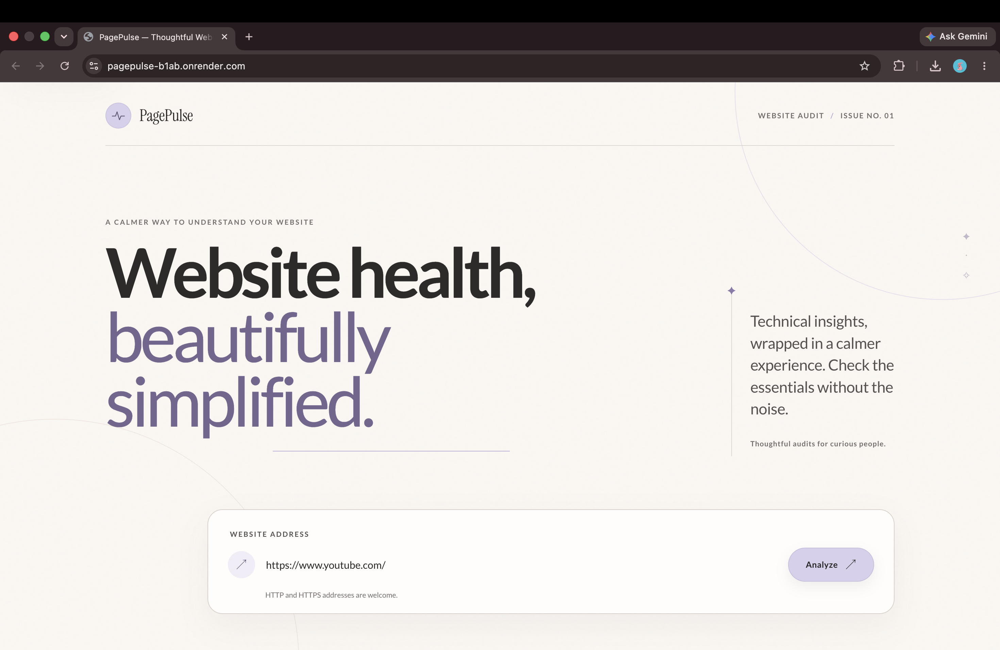
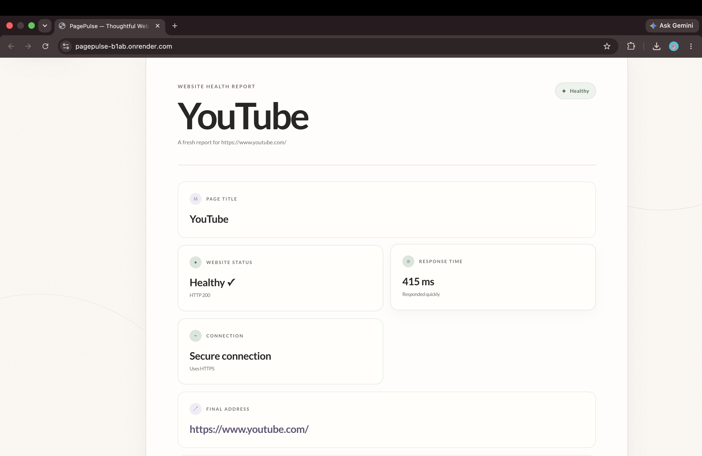
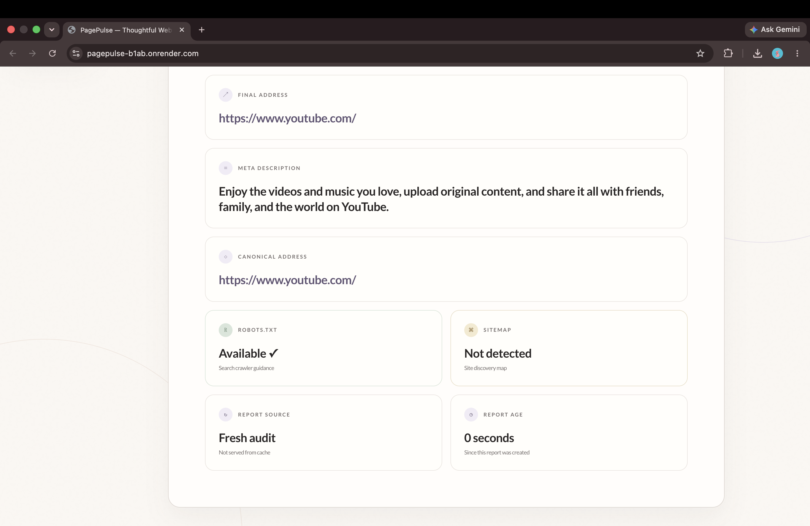
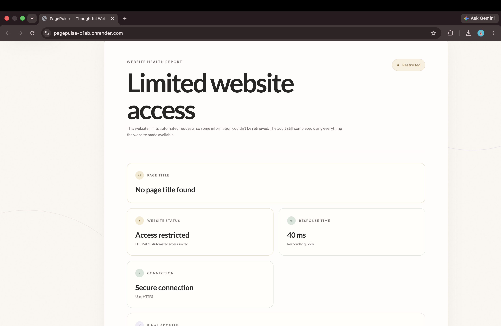
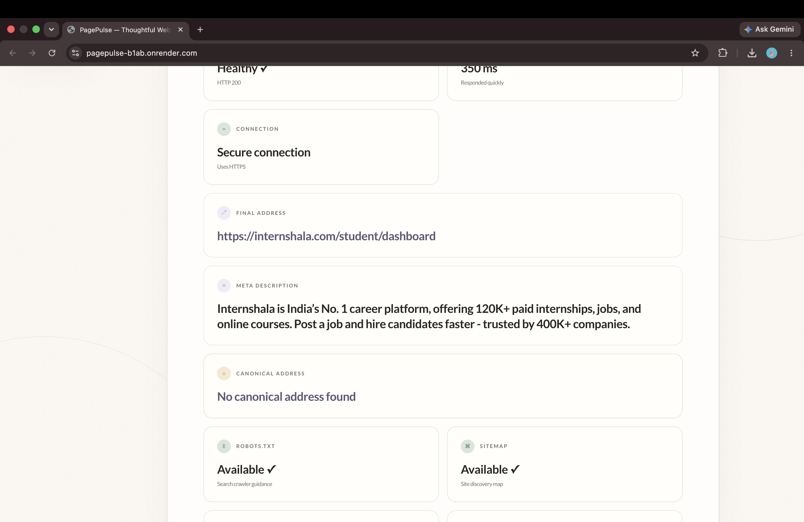

# PagePulse
[](https://www.typescriptlang.org/)
[](https://nodejs.org/)
[](#testing)
[](LICENSE)
> Thoughtful Website Health Audits

PagePulse audits public websites for availability, HTTPS, response time, metadata, and discovery files. It provides a focused browser interface and a structured API backed by caching, rate limiting, production logging, and automated tests.

---

| Resource | Link |
|----------|------|
| Live Demo | [pagepulse-b1ab.onrender.com](https://pagepulse-b1ab.onrender.com) |
| GitHub Repository | [soumyasax3010/PagePulse](https://github.com/soumyasax3010/PagePulse) |
## Features

### Website Auditing

- [x] Website availability
- [x] HTTPS detection
- [x] Response time measurement
- [x] Page title extraction
- [x] Meta description extraction
- [x] Canonical URL detection
- [x] `robots.txt` detection
- [x] `sitemap.xml` detection

### Reliability and Operations

- [x] Smart caching
- [x] Cache age reporting
- [x] Graceful handling of restricted websites
- [x] Production logging
- [x] Rate limiting
- [x] Automated testing
- [x] Continuous integration

---

## Screenshots

### Homepage

<p align="center">
  
</p>

---

### Healthy Website Report

<p align="center">
  
</p>

---

### Metadata & Discovery

<p align="center">
  
</p>

---

### Restricted Website Handling

<p align="center">
  
</p>

---

### Another Healthy Website Example

<p align="center">
  
</p>

---

### Discovery & Cache Information

<p align="center">
  
</p>


## Architecture

Requests pass through Express middleware for logging, JSON parsing, and rate limiting before reaching the audit controller. The audit service coordinates normalized-URL caching, page fetching, metadata extraction, and discovery-file checks.

```text
Client
  ↓
Express routes and middleware
  ↓
Audit controller
  ↓
Audit service ↔ In-memory cache
  ↓
Target website
  ↓
Audit service → Controller → Client
```

See [docs/architecture.md](docs/architecture.md) for the complete request flow and [docs/task-b.md](docs/task-b.md) for design trade-offs and scalability notes.

---

## API

| Method | Endpoint  | Description                                        |
| ------ | --------- | -------------------------------------------------- |
| `GET`  | `/health` | Reports whether the service is accepting requests. |
| `POST` | `/audit`  | Audits an absolute HTTP or HTTPS URL.              |

### Audit a URL

```bash
curl --request POST http://localhost:3000/audit \
  --header 'Content-Type: application/json' \
  --data '{"url":"https://example.com"}'
```

### Successful Response

```json
{
  "success": true,
  "data": {
    "url": "https://example.com",
    "finalUrl": "https://example.com/",
    "status": 200,
    "responseTime": 123,
    "title": "Example Domain",
    "isHttps": true,
    "metaDescription": null,
    "canonicalUrl": null,
    "robotsTxtExists": false,
    "sitemapExists": false
  },
  "cacheHit": false,
  "cacheAgeSeconds": 0
}
```

An upstream non-2xx response is still a completed audit when the HTTP exchange succeeds. Application failures use structured errors:

| Status | Code                  | Meaning                                                                |
| -----: | --------------------- | ---------------------------------------------------------------------- |
|  `400` | `INVALID_URL`         | The value is not an absolute HTTP or HTTPS URL.                        |
|  `429` | `RATE_LIMIT_EXCEEDED` | The PagePulse client-IP limit was exceeded.                            |
|  `502` | `FETCH_FAILED`        | The target could not be reached or its response could not be consumed. |

---

## Tech Stack

| Category               | Technology                |
| ---------------------- | ------------------------- |
| Runtime                | Node.js                   |
| API                    | Express                   |
| Language               | TypeScript                |
| Frontend               | HTML, CSS, and JavaScript |
| HTML parsing           | Cheerio                   |
| Logging                | Pino                      |
| Testing                | Vitest and Supertest      |
| Continuous integration | GitHub Actions            |
| Deployment             | Render                    |

---

## Running Locally

### Prerequisites

- Node.js 22 or another version supported by `package.json`
- npm

```bash
git clone https://github.com/soumyasax3010/PagePulse.git
cd PagePulse
npm install
cp .env.example .env
npm run dev
```

Open `http://localhost:3000` to use the web interface.

### Environment

Configuration is optional and validated at startup.

| Variable                    |       Default |
| --------------------------- | ------------: |
| `PORT`                      |        `3000` |
| `HOST`                      |     `0.0.0.0` |
| `NODE_ENV`                  | `development` |
| `CACHE_TTL_SECONDS`         |         `300` |
| `RATE_LIMIT_MAX_REQUESTS`   |          `30` |
| `RATE_LIMIT_WINDOW_SECONDS` |          `60` |

Build and run the production server:

```bash
npm run build
NODE_ENV=production npm start
```

---

## Testing

| Command                 | Purpose                                       |
| ----------------------- | --------------------------------------------- |
| `npm test`              | Run the complete test suite once.             |
| `npm run test:coverage` | Run the suite and generate a coverage report. |

Unit tests cover URL normalization, environment validation, metadata extraction, caching, and rate limiting. Integration tests exercise the audit endpoint without public internet access.

GitHub Actions runs linting, tests, and the TypeScript build on every push and pull request.

---

## Engineering Decisions

- **Caching:** Successful audits are cached by normalized URL with a configurable TTL. Concurrent requests for the same URL share in-progress work; validation and fetch failures are never cached.
- **Timeout handling:** Network timeouts and transport failures use the structured `502 FETCH_FAILED` path, and partial results are not cached.
- **Validation:** Inputs must be non-empty, absolute HTTP or HTTPS URLs before outbound work begins.
- **Structured logging:** Pino emits JSON request and audit logs with request IDs, timing data, outcomes, and sensitive-field redaction.
- **Graceful degradation:** Missing metadata is returned as `null`, and optional discovery checks do not hide the rest of the report.
- **Restricted websites:** Target responses such as `403`, `429`, and `999` remain completed audits. The interface identifies the access restriction instead of presenting an application failure.

---

## Scalability

At scale, PagePulse can run as multiple stateless API instances behind a load balancer, with Redis providing shared cache and rate-limit state. A queue and worker processes can handle longer-running audits, while centralized metrics, logs, tracing, and alerts provide operational visibility.

---

## Project Structure

```text
PagePulse/
├── .github/
│   └── workflows/
│       └── ci.yml
├── docs/
│   ├── architecture.md
│   └── task-b.md
├── public/
│   ├── index.html
│   ├── script.js
│   └── styles.css
├── src/
│   ├── config/
│   ├── controllers/
│   ├── middleware/
│   ├── routes/
│   ├── services/
│   ├── utils/
│   ├── app.ts
│   └── server.ts
├── tests/
│   ├── integration/
│   └── unit/
├── .env.example
├── package.json
├── tsconfig.json
└── vitest.config.ts
```

---

## Future Improvements

- Add SSRF and DNS-rebinding protection for untrusted public use.
- Add explicit outbound request deadlines and response-size limits.
- Add global and per-origin concurrency controls.
- Publish an OpenAPI specification with contract tests.

---

## Author

Soumya Saxena

---

## License

MIT
